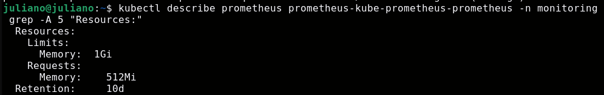
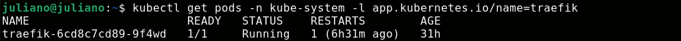

# Registro de Incidentes (SRE) / Incident Response Log

## INC-01: OOMKilled no Prometheus / OOMKilled in Prometheus

- **Problema / Problem:** Pods do Prometheus reiniciando por estouro de memória. / Prometheus pods restarting due to memory exhaustion.
- **Diagnóstico / Diagnosis:** Limites de recursos (requests/limits) insuficientes para o volume de métricas. / Insufficient resource limits for the volume of metrics.
- **Resolução / Resolution:** Ajuste dos limites para 1Gi RAM via Helm/YAML. / Adjusted resource limits to 1Gi RAM via Helm/YAML.

---

## INC-02: Diagnóstico de Ingress Controller / Ingress Controller Diagnostics

- **Problema / Problem:** Instabilidade no roteamento de tráfego externo. / Instability in external traffic routing.
- **Diagnóstico / Diagnosis:** Falha na validação do status do Traefik. / Failure in Traefik status validation.
- **Resolução / Resolution:** Revalidação da integridade dos pods do sistema. / Re-validation of system pod integrity.

